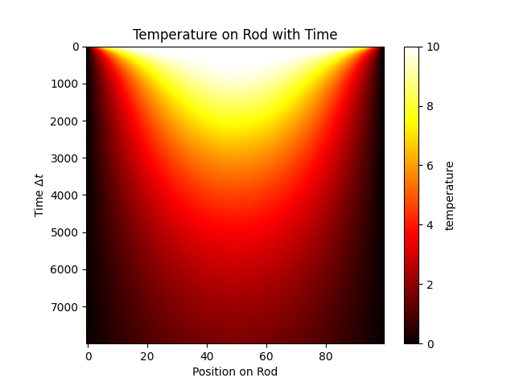

# Finite Differences to Solve PDEs

This repository implements the finite differences method to solve the heat equation in 1D

GitHub doesn't currently support LaTeX in markdown files, so it's not possible to give a
really nice looking description of the numerical scheme, however I'll release a PDF paper
explaining this soon.

## Results

These two images are the output from the numerical scheme for the heat equation, where each row in the image is the temperature of the rod, and each row increments time by delta t.  

The first image is for a non-insulating boundary, so heat quickly dissipates on the rod with time.

The second image is for an insulating boundary on the left, which means that heat is not lost near the left boundary.

